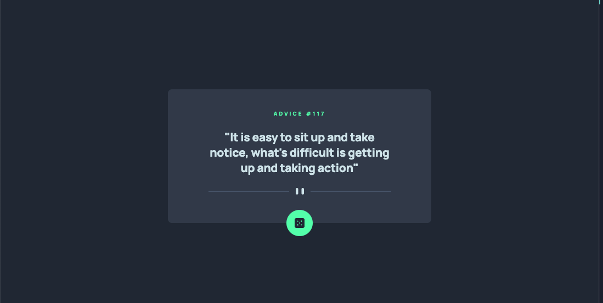

# Frontend Mentor - Advice generator app

## Welcome! 👋

Thanks for checking out this front-end coding challenge.

[Frontend Mentor](https://www.frontendmentor.io) challenges help you improve your coding skills by building realistic projects.

**To do this challenge, you need a basic understanding of HTML, CSS and JavaScript.**

## The challenge

My challenge is to build out this advice generator app using the [Advice Slip API](https://api.adviceslip.com) and get it looking as close to the design as possible.

Users should be able to:

- View the optimal layout for the app depending on their device's screen size
- See hover states for all interactive elements on the page
- Generate a new piece of advice by clicking the dice icon

## Built with
- HTML
- CSS
- JavaScript

## Helpful Resources
- [How to Use SVG Images in CSS and HTML – A Tutorial for Beginners](https://www.freecodecamp.org/news/use-svg-images-in-css-html/#:~:text=SVG%20images%20can%20be%20written,element%20in%20your%20HTML%20document.&text=body%3E-,If%20you%20did%20everything%20correctly%2C%20your%20webpage%20should,exactly%20like%20the%20demo%20below.) - This helped me to use svg icons and images in HTML or as CSS background.
- [Axios - getting started](https://axios-http.com/docs/intro) - This helped me to get started with axios.

